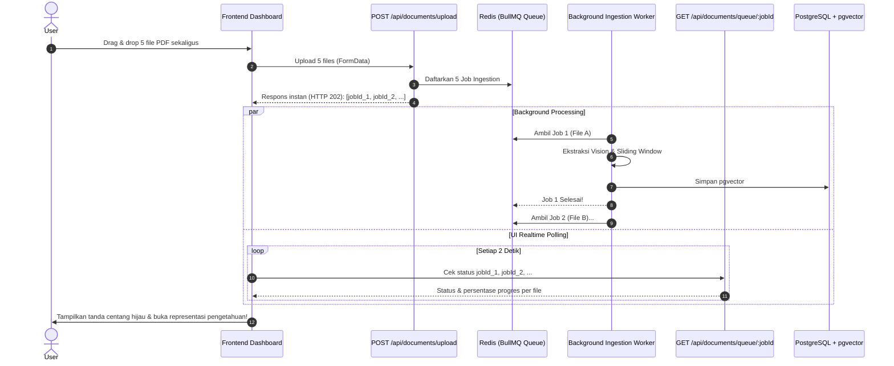

# Blueprint Fitur: Bulk Multi-File Upload & Asynchronous Queue Worker

Dokumen ini adalah cetak biru teknis (*technical blueprint*) untuk mengimplementasikan fitur **Unggah Banyak File PDF Sekaligus (Bulk Upload)** menggunakan arsitektur **Asynchronous Queue + Controlled Concurrency** di BrilianAI.

---

## 1. Analisis Masalah & Pemilihan Arsitektur

### Mengapa Bukan Synchronous?
Jika pengguna mengunggah 10 file PDF secara sinkron (*synchronous*), browser akan menahan koneksi HTTP hingga 10-15 menit menunggu AI Vision & Embedding selesai. Hal ini pasti memicu:
- **Error `504 Gateway Timeout`** di Nginx / Cloudflare.
- Browser pengguna membeku (*freeze*).
- Jika koneksi internet terputus di tengah jalan, seluruh proses gagal.

### Mengapa Bukan Murni Parallel Processing (Multi-threading Tanpa Batas)?
AI Vision (`qwen2.5vl:3b`) dan Embedding (`bge-m3`) adalah proses yang sangat rakus CPU & RAM. Menjalankan 10 inferensi AI secara bersamaan di detik yang sama akan:
- Membuat penggunaan CPU menyentuh 100% secara instan.
- Memicu **Out Of Memory (OOM) Crash**, menyebabkan server VPS meledak/mati mendadak.

### Solusi Standar Industri: Asynchronous Queue + Controlled Concurrency
1. **Asynchronous:** Browser mengunggah 10 file PDF -> Server langsung merespons dalam 1-2 detik dengan status `202 Accepted` dan mengembalikan daftar `jobIds`. Koneksi HTTP langsung selesai tanpa risiko timeout.
2. **Antrean Terkontrol (BullMQ + Redis):** Seluruh file masuk ke antrean (*queue*).
3. **Worker Pool (Controlled Concurrency = 1 atau 2):** Worker memproses antrean satu per satu (atau 2 secara paralel jika VPS memiliki banyak core). Begitu file 1 selesai, otomatis pindah ke file berikutnya.
4. **Pelacakan Progres Real-Time:** UI menampilkan status hidup untuk tiap file: `Menunggu Antrean (Queue)` ➔ `Memproses Vision OCR (40%)` ➔ `Membuat Vektor pgvector (80%)` ➔ `Selesai (100%)`.

---

## 2. Alur Kerja Sistem (Sequence Diagram)



---

## 3. Rincian Modul yang Akan Diubah / Dibuat

### A. Modifikasi Antarmuka UI `[MODIFY]` [src/app/page.tsx]
1. Mengubah elemen input file menjadi multi-file:
   ```tsx
   <input type="file" multiple accept="application/pdf" ... />
   ```
2. Mengubah `handleDrop` dan `handleFileChange` agar membaca seluruh `File[]`:
   ```typescript
   const files = Array.from(e.dataTransfer.files).filter(f => f.type === 'application/pdf');
   ```
3. Menambahkan komponen **Bulk Upload Progress Card**:
   - Menampilkan daftar file yang sedang diunggah dalam bentuk tabel/list.
   - Status badge per item: `⏳ Mengantre`, `⚡ Mengekstrak Halaman`, `🧠 Embedding`, `✅ Selesai`.

### B. Modifikasi API Upload `[MODIFY]` [src/app/api/documents/upload/route.ts]
Menerima `formData.getAll('files')` dan tidak lagi memblokir request:
```typescript
export async function POST(req: NextRequest) {
  const formData = await req.formData();
  const files = formData.getAll('files') as File[];

  const jobs = [];
  for (const file of files) {
    const buffer = Buffer.from(await file.arrayBuffer());
    const job = await addPdfToIngestQueue(buffer, file.name);
    jobs.push({ jobId: job.id, filename: file.name });
  }

  return NextResponse.json({
    message: `${jobs.length} file berhasil dimasukkan ke dalam antrean.`,
    jobs,
  }, { status: 202 });
}
```

### C. Endpoint Pemantau Status `[NEW]` [src/app/api/documents/queue/[jobId]/route.ts]
Endpoint polling ringan untuk membaca status BullMQ Job:
```typescript
export async function GET(req: NextRequest, { params }: { params: { jobId: string } }) {
  const queue = getIngestQueue();
  const job = await queue.getJob(params.jobId);
  if (!job) return NextResponse.json({ error: 'Job not found' }, { status: 404 });

  const state = await job.getState(); // 'waiting' | 'active' | 'completed' | 'failed'
  const progress = job.progress;
  const result = job.returnvalue;

  return NextResponse.json({
    id: job.id,
    state,
    progress,
    result,
  });
}
```

### D. Optimasi Worker `[MODIFY]` [lib/queue/ingestQueue.ts]
- Pisahkan fungsi pendaftaran job (`addPdfToIngestQueue`) dari proses menunggu.
- Konfigurasi `concurrency`:
  - Default: `concurrency: 1` (paling aman untuk VPS 2 vCPU / 4GB RAM).
  - Configurable via ENV `INGEST_CONCURRENCY=1` atau `2`.
- Tambahkan pelaporan progres `job.updateProgress(percent)` di setiap tahapan pipeline (ekstraksi, chunking, embedding).

---

## 4. Rekomendasi Concurrency Berdasarkan Spesifikasi VPS

| Spesifikasi VPS | Rekomendasi Concurrency | Estimasi Kecepatan |
| :--- | :---: | :--- |
| **2 vCPU / 4 GB RAM** | `concurrency: 1` | 1 file diproses bergantian (VPS 100% aman dari OOM). |
| **4 - 8 vCPU / 8 - 16 GB RAM** | `concurrency: 2` | 2 file diproses paralel (kecepatan 2x lipat). |
| **VPS dengan GPU (NVIDIA T4 / A10)** | `concurrency: 3 - 4` | Pemrosesan sangat cepat, hingga 4 file paralel. |

---

## 5. Perintah Eksekusi Instan (Ketika Anda Ingin Menerapkan)
Saat Anda ingin fitur ini diaktifkan secara menyeluruh di proyek, cukup berikan instruksi:
> *"Terapkan fitur Bulk Upload Async Queue sesuai blueprint `docs/FEATURE_BULK_UPLOAD_ASYNC_QUEUE.md`"*

Agent AI akan langsung:
1. Mengupdate `src/app/page.tsx` untuk multi-file drag-and-drop dan kartu progres antrean.
2. Memperbarui `src/app/api/documents/upload/route.ts` menjadi *non-blocking async dispatcher*.
3. Membuat route `src/app/api/documents/queue/[jobId]/route.ts`.
4. Mengaktifkan pelaporan progress di `lib/queue/ingestQueue.ts`.
5. Menguji dengan Vitest dan menjalankan build verifikasi.
