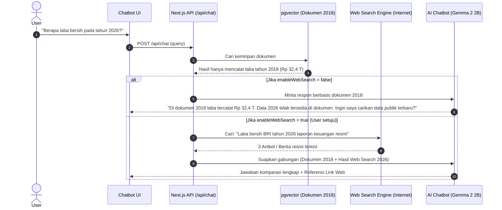

# Blueprint Fitur: Web Search Grounding & Tarik Data Publik Terkini

Dokumen ini adalah cetak biru teknis (*technical blueprint*) untuk mengimplementasikan fitur **Tarik Data Publik / Web Search Grounding** pada chatbot BrilianAI.

---

## 1. Latar Belakang & Masalah Pengguna
- **Masalah:** Dokumen yang diunggah ke BrilianAI mungkin merupakan dokumen lampau (contoh: *Laporan Tahunan 2018*). Saat pengguna bertanya perbandingan atau kondisi terkini (contoh: *laba/kinerja di tahun 2026*), AI lokal murni tidak dapat menjawab karena data tidak ada di dokumen dan batas waktu training (*knowledge cutoff*).
- **Solusi:** Sistem menambahkan kemampuan **Search Grounding** secara kondisional. Jika diizinkan atau terdeteksi data dokumen sudah lama, sistem otomatis mencari data publik terkini dari internet, merangkumnya lewat AI lokal (**Gemma 2 2B**), dan menyajikan perbandingan antara data dokumen vs data publik terbaru.

---

## 2. Alur Pengguna (User Experience Flow)



---

## 3. Komponen Teknis yang Akan Dibuat / Dimodifikasi

### A. Modul Pencarian Web `[NEW]` [lib/search/webSearchClient.ts]
Modul ini bertugas mencari data publik di internet tanpa bergantung pada API berbayar (menggunakan scraper legal / DuckDuckGo / Tavily):

```typescript
export interface WebSearchResult {
  title: string;
  url: string;
  snippet: string;
}

export async function searchPublicWeb(query: string, limit: number = 3): Promise<WebSearchResult[]> {
  // 1. Format kata kunci pencarian teroptimasi
  // 2. Fetch hasil dari DuckDuckGo / Search API
  // 3. Ekstrak judul, URL, dan ringkasan isi berita/laporan
  // 4. Return array hasil pencarian
}
```

### B. Modifikasi Chat Service `[MODIFY]` [lib/chat/chatService.ts]
Tambahkan logika pendeteksian dan penggabungan konteks web:
- Tambahkan opsi: `enableWebSearch?: boolean`.
- Jika `enableWebSearch: true`:
  - Ambil top 3 hasil web pencarian via `searchPublicWeb`.
  - Format konteks web:
    ```text
    --- SUMBER WEB PUBLIK TERBARU ---
    [1] Judul: ... (URL: ...)
    Ringkasan: ...
    ```
  - Gabungkan dengan `--- KONTEKS DOKUMEN ---`.
  - Kembalikan properti `webSources` dalam respons chat.

### C. Modifikasi System Prompt `[MODIFY]` [lib/ai/chatClient.ts]
Tambahkan template prompt grounding komparatif:
> *"Anda diberikan dua sumber: (1) KONTEKS DOKUMEN INTERNAL dan (2) DATA PUBLIK DARI INTERNET. Berikan jawaban yang jelas. Jika pengguna menanyakan tahun atau perkembangan terkini yang tidak ada di dokumen, gunakan data publik dan sebutkan sumber beritanya secara transparan."*

### D. Modifikasi Payload API `[MODIFY]` [src/app/api/chat/route.ts]
Request Body:
```json
{
  "query": "Berapa laba terbaru tahun 2026?",
  "documentId": "uuid-batch",
  "allowPublicKnowledge": true,
  "enableWebSearch": true
}
```

Response Body:
```json
{
  "answer": "Berdasarkan Laporan Tahunan 2018 di dokumen Anda, laba bersih tercatat Rp 32,4 triliun. Berdasarkan data publik terbaru 2026 dari [Kementerian BUMN / Berita Resmi], laba mencapai Rp XX triliun...",
  "sources": [
    { "type": "document", "page": 10, "filename": "laporan_2018.pdf" }
  ],
  "webSources": [
    { "title": "Kinerja Finansial Terbaru 2026", "url": "https://...", "snippet": "..." }
  ]
}
```

### E. Tampilan UI Chatbot `[MODIFY]` [src/components/KnowledgeRepresentation.tsx / Chat Modal]
1. Terdapat tombol toggle/checkbox: **🌐 "Izinkan Tarik Data Publik Terbaru dari Web"**.
2. Jika dokumen sudah lewat dari tahun yang ditanyakan, AI memberikan tombol cepat:
   `[🔍 Tarik Data Publik Terbaru 2026 Sekarang]`
3. Di bawah jawaban AI, tampil badge link sumber internet yang bisa diklik langsung oleh pengguna.

---

## 4. Opsi Penyedia Mesin Pencari (Search Engine Provider)

| Provider | Biaya | Kecepatan | Kualitas Khusus Dokumen & Berita |
| :--- | :--- | :--- | :--- |
| **DuckDuckGo (Scraper)** | **Gratis (100% Free)**, tanpa API key | Cepat (~1-2 detik) | Bagus untuk pencarian informasi umum & berita Indonesia |
| **Tavily Search API** | Tier gratis 1.000 req/bulan | Sangat Cepat (< 1 detik) | Khusus dirancang untuk AI RAG (langsung memberikan ringkasan faktual) |
| **Serper / Google Search** | Tier gratis 2.500 req | Sangat Cepat (< 1 detik) | Index Google terlengkap untuk data Indonesia |

---

## 5. Perintah Eksekusi Sekali Jalan (Ketika Anda Ingin Menerapkan)
Saat Anda ingin fitur ini diaktifkan, cukup instruksikan:
> *"Terapkan fitur Web Search Grounding sesuai blueprint `docs/FEATURE_WEB_SEARCH_GROUNDING.md`"*

Agent AI akan langsung:
1. Memasang pustaka pencari web (`npm i duck-duck-scrape` atau konfigurasi API).
2. Membuat file `lib/search/webSearchClient.ts`.
3. Menghubungkan ke `lib/chat/chatService.ts` dan API route `/api/chat`.
4. Menambahkan tombol aksi & sitasi web di UI.
5. Menjalankan pengujian otomatis `vitest` dan build produksi.
